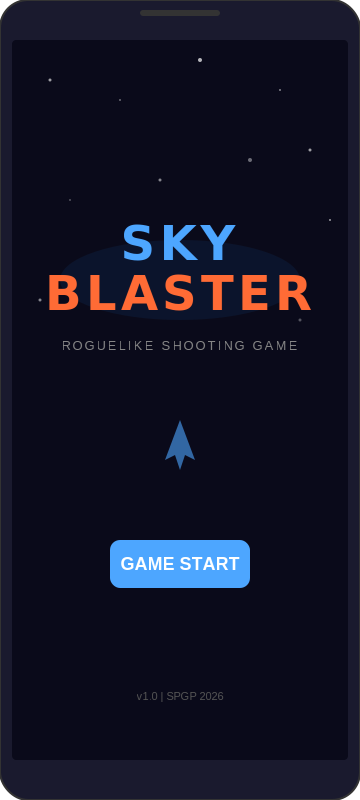
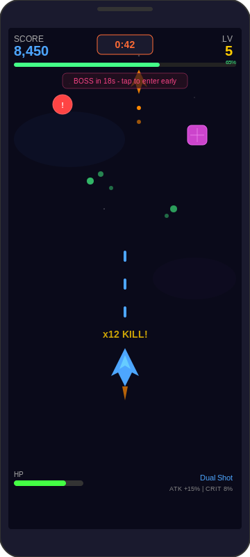
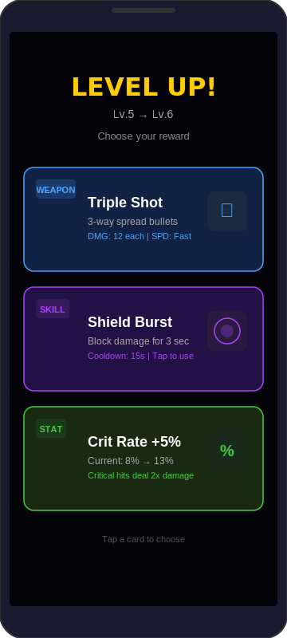
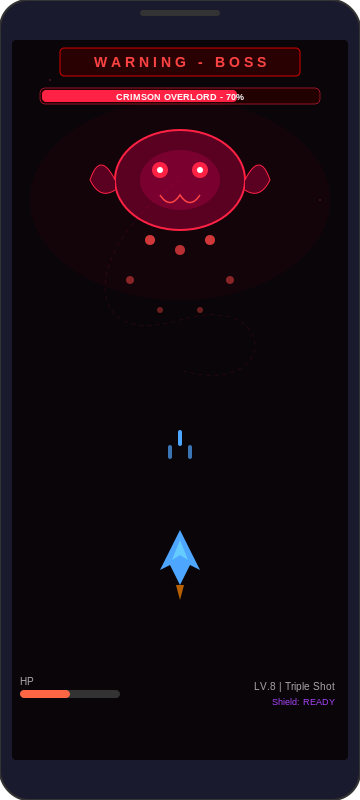
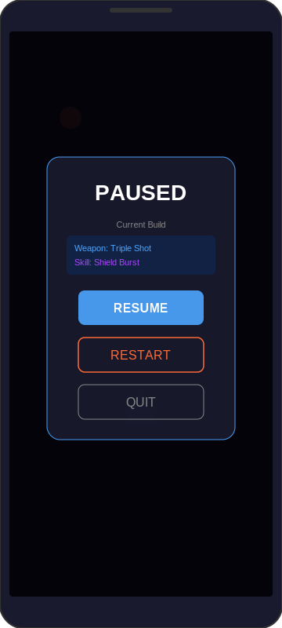
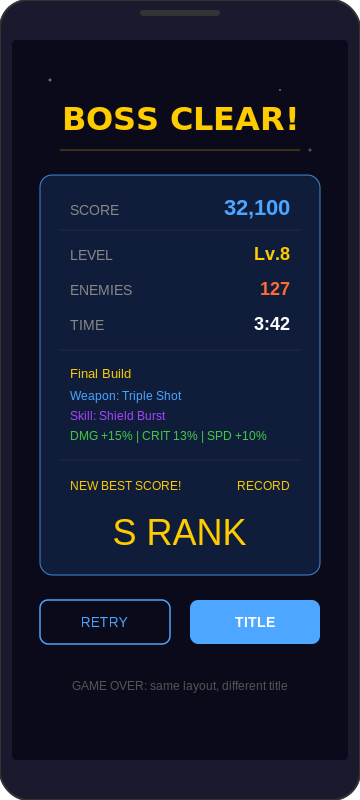

# Sky Blaster

> **종스크롤 슈팅 × 로그라이크** — Android 2D Game

---

## 1. 게임 컨셉

### High Concept

**Sky Blaster**는 종스크롤 장르와 로그라이크를 결합한 안드로이드 슈팅 게임으로, 몰려오는 적을 처치하여 랜덤한 보상을 얻은 후 보스전을 클리어 하는 게임이다.

### 핵심 메카닉

| 메카닉 | 설명 |
|--------|------|
| **터치 드래그 이동** | 화면을 터치한 채 드래그하여 캐릭터를 자유롭게 이동 |
| **자동 발사** | 총알은 자동으로 발사되며, 얻은 보상에 따라 터치하면 발사하는 스킬을 획득할 수 있음 |
| **레벨업 시스템** | 적 처치 시 경험치를 얻고 레벨업을 하면 3개의 보상 중에 선택할 수 있으며 보상에 따라 무기가 달라질 수 있음 |
| **일반 스테이지** | 일반 스테이지에서 몰려오는 적들을 처치하며 1분 간격으로 보스전을 진입할 것인지, 계속 레벨업을 진행할 것인지 선택 |
| **보스 스테이지** | 보스 스테이지에서는 강력한 보스몬스터가 등장 |

---

## 2. 개발 범위

### 정량적 개발 범위

| 항목 | 수량 |
|------|------|
| 플레이어 캐릭터 | 1종 |
| 일반 적 | 3종 (근거리 자폭병, 원거리 몬스터, 분열형 몬스터) |
| 보스 | 1종 |
| 스테이지 | 2종 (일반 스테이지, 보스 스테이지) |
| 레벨업 보상 | 무기 3종, 스킬 3종, 능력치 증가 3종 (데미지, 공격속도, 치명타) — 총 9~10종 |
| 배경 | 스크롤 배경 2종 |
| 이펙트 | 10종+ (무기별 공격, 피격, 스킬, 레벨업, 클리어) |
| BGM | 2종 |

---

## 3. 예상 게임 실행 흐름

### ① 타이틀 화면

- 게임 로고와 배경 별 연출
- GAME START 버튼으로 바로 일반 스테이지 진입
- 매 판 새로운 빌드로 시작하는 로그라이크 구조

---

### ② 일반 스테이지 (메인 플레이)

- 스크롤 배경 위에서 적이 사방에서 출현
- 적 3종이 등장:
  - **자폭병** (빨간 원) — 빠르게 접근하여 자폭
  - **원거리 몬스터** (주황 삼각) — 멀리서 탄환 발사
  - **분열형 몬스터** (보라 사각) — 처치 시 작은 몬스터로 분열
- 적 처치 → **경험치 구슬** 드롭 → 자동 흡수
- 상단 HUD: 점수, 타이머(보스 진입까지), 레벨, EXP 바
- 하단 HUD: HP, 현재 무기, 능력치 정보
- **1분 간격**으로 보스전 진입 여부 선택 가능

---

### ③ 레벨업 — 보상 선택 (Transparent Scene)

- 경험치가 가득 차면 게임이 잠시 멈추고 **보상 선택 화면** 등장
- **3개의 카드** 중 1개를 선택:
  - **무기** (파란색) — Dual Shot, Triple Shot, Laser 등
  - **스킬** (보라색) — Shield Burst, Homing Missile 등, 터치로 발동
  - **능력치** (초록색) — 데미지 증가, 공격속도 증가, 치명타 확률 증가
- 선택 후 즉시 게임 재개
- 매 레벨업마다 랜덤 3개가 제시되어 **매 판 다른 빌드**를 경험

---

### ④ 보스 스테이지

- 보스전 진입 시 **WARNING** 연출과 함께 전환
- 보스가 Bezier Curve 경로를 따라 이동하며 패턴 공격
- 보스 HP 바 상단 표시
- 일반 스테이지에서 쌓은 무기·스킬·능력치로 보스에 도전
- 파밍을 더 할수록 강해지지만, 보스도 시간에 따라 강화될 수 있음

---

### ⑤ 일시정지 (Transparent Scene)

- **반투명 오버레이**로 게임 화면 위에 표시
- 현재 빌드 요약 (획득한 무기·스킬) 표시
- Resume / Restart / Quit 선택

---

### ⑥ 결과 화면 (클리어 / 게임 오버)

- 보스 클리어 시 **BOSS CLEAR!**, 사망 시 **GAME OVER** 표시
- 최종 점수, 도달 레벨, 처치 수, 플레이 시간
- **Final Build** — 최종 무기·스킬·능력치 요약
- S/A/B/C 랭크 부여
- 최고 기록 갱신 시 표시
- Retry / Title 선택

---

## 4. 개발 일정

> 4월 6일 시작 기준, 8주간 주단위 일정

| 주차 | 기간 | 구현 항목 | 세부 내용 |
|------|------|----------|----------|
| **1주차** | 4/6 ~ 4/12 | 프로젝트 셋업 구현 | CustomView 기반 GameView,  Scene 전환 구조, 리소스 수집 |
| **2주차** | 4/13 ~ 4/19 | 플레이어 + 배경 | Player 구현, 터치 드래그 이동, 자동 발사, 스크롤 배경 2종 |
| **3주차** | 4/20 ~ 4/26 | 적 + 충돌 + Recycle | 적 3종 구현 (자폭병, 원거리, 분열형), EnemyGenerator, ObjectPool, 충돌 처리 |
| **4주차** | 4/27 ~ 5/3 | EXP + 레벨업 시스템 | 경험치 구슬 드롭·흡수, 레벨업 보상 선택 UI (3카드), 무기 3종 구현 |
| **5주차** | 5/4 ~ 5/10 | 스킬 + 능력치 시스템 | 스킬 3종 구현 (터치 발동), 능력치 증가 적용, 보스 진입 타이머·선택 UI |
| **6주차** | 5/11 ~ 5/17 | 보스전 | 보스 Bezier 이동 패턴, 패턴 공격, 보스 HP 바, 보스 스테이지 Scene |
| **7주차** | 5/18 ~ 5/24 | 이펙트 + 사운드 + UI | Frame Animation 이펙트 10종+, BGM 2종 적용, 타이틀·결과·Pause 화면 |
| **8주차** | 5/25 ~ 5/31 | 버그 검토 및 최종 완성 | 버그 검토 및 최종적으로 부족한 부분 점검 |

---
